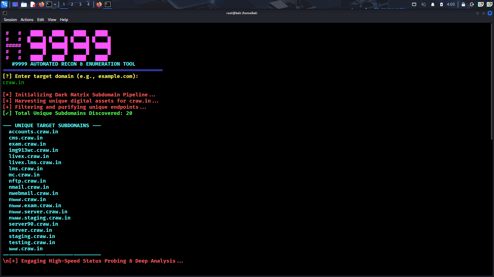
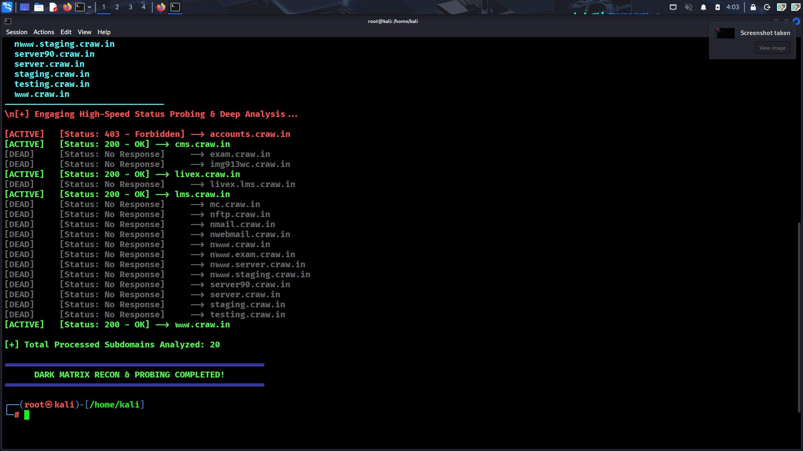

# 🚀 SubRecon & Live Status Prober (v1.0.0)

> A robust, high-speed, and fully automated reconnaissance utility built entirely in **Bash (`.sh`)** for Bug Bounty hunters, penetration testers, and security enthusiasts. 

---

## 📖 Table of Contents
1. [About The Tool](#-about-the-tool)
2. [Key Features & Capabilities](#-key-features--capabilities)
3. [How It Works (Step-by-Step)](#-how-it-works-step-by-step)
4. [Prerequisites & Dependencies](#-prerequisites--dependencies)
5. [Installation Guide](#-installation-guide)
6. [Usage & Execution](#-usage--execution)
7. [Understanding the Output & Status Codes](#-understanding-the-output--status-codes)
8. [Author & Disclaimer](#-author--disclaimer)




---

## 🔍 About The Tool

In modern web application security assessments and bug bounty programs, the very first and most crucial phase is **Reconnaissance (Recon)**. Finding hidden assets, forgotten staging servers, and active endpoints can expose critical attack surfaces. 

**SubRecon & Live Status Prober** is designed to streamline this initial phase. Instead of manually running multiple commands or scripts, this tool automates the entire workflow: from discovering potential subdomains of a target organization to performing high-speed HTTP probing and deep analysis of their active status and response codes. Written completely in native Bash, it is lightweight, fast, and does not require heavy frameworks to run.

---

## 🌟 Key Features & Capabilities

* **Automated Subdomain Gathering:** Rapidly extracts potential subdomains from various internal lists and intelligence sources for any target domain.
* **High-Speed Status Probing:** Performs multi-threaded or rapid sequential requests to test the availability of every single discovered endpoint[cite: 6].
* **Real-Time Deep Analysis:** Evaluates whether an endpoint is live or dead, giving you instant clarity on your target architecture[cite: 6].
* **HTTP Status Code Tracking:** Categorizes and displays standard HTTP response codes (such as `200 OK`, `403 Forbidden`, etc.) right next to the active domains[cite: 6].
* **Clean & Verbose Terminal Output:** Uses color-coded tags (`[ACTIVE]`, `[DEAD]`, `[+]`, `[*]`) so you can track the script's progress step-by-step in real time[cite: 6].

---

## ⚙️ How It Works (Step-by-Step Workflow)

1. **Target Initialization:** Upon launching, the script prompts the user to enter a target domain name (e.g., `example.com` or `craw.in`)[cite: 6].
2. **Enumeration Phase:** The tool processes the domain to compile a master list of potential subdomains[cite: 6].
3. **Deep Status Analysis:** It initiates a high-speed probing loop, sending HTTP/HTTPS requests to every discovered sub-host[cite: 6].
4. **Result Classification:** 
   * **[ACTIVE]** subdomains are flagged along with their exact HTTP status codes (e.g., `200 - OK`, `403 - Forbidden`)[cite: 6].
   * **[DEAD]** subdomains or unreachable hosts are marked clearly as `No Response`[cite: 6].

---

## 📦 Prerequisites

Before installing and running the tool, ensure your Linux environment (preferably Kali Linux or Parrot OS) has basic utilities installed:
* `curl` or `wget`
* Standard coreutils (`grep`, `awk`, `sed`, `sort`)

---

## 📥 Installation Guide

To download and set up the tool locally on your system, execute the following commands in your terminal:

### Step 1: Clone the Repository
Clone the project from GitHub to your local machine using the `git clone` command:
```bash
https://github.com/NullByte9999/SubRecon-9999.git
```

Step 2: Navigate into the Project Directory
Change your current working directory to the newly created folder:
```
cd SubRecon-Tool
```
Step 3: Grant Executable Permissions
Since it is a Bash script (.sh), you must give it execution permissions using the chmod command:
```
chmod +x subrecon.sh
```
💻 **Usage & Execution**
Once the installation and permission steps are completed, you can run the tool directly from your terminal:
```
./subrecon.sh
```
##Execution Example:
Run the script.

When prompted (Enter Target Domain:), type your target domain (for example: craw.in)[cite: 6].

Watch the terminal as it performs subdomain discovery followed by High-Speed Status Probing & Deep Analysis[cite: 6].

##v📊 **Understanding the Output & Status Codes**
During the deep analysis phase, you will see output structured like this:
```
[+] Engaging High-Speed Status Probing & Deep Analysis ...

[ACTIVE] [Status: 403 - Forbidden] → accounts.craw.in
[ACTIVE] [Status: 200 - OK]        → cms.craw.in
[DEAD]   [Status: No Response]     → exam.craw.in
[ACTIVE] [Status: 200 - OK]        → livex.craw.in
```
[ACTIVE] / [Status: 200 - OK]: Indicates that the web server is up and returning content successfully.

[ACTIVE] / [Status: 403 - Forbidden]: The server is alive, but access to the specific resource is restricted (worth investigating for hidden directories/bypasses).

[DEAD] / [Status: No Response]: The subdomain does not resolve or the server is currently down/offline.


##🛡️** Disclaimer**
This tool is developed strictly for educational purposes, authorized security testing, and bug bounty programs with explicit permission. The author is not responsible for any misuse or illegal activities conducted using this script.
